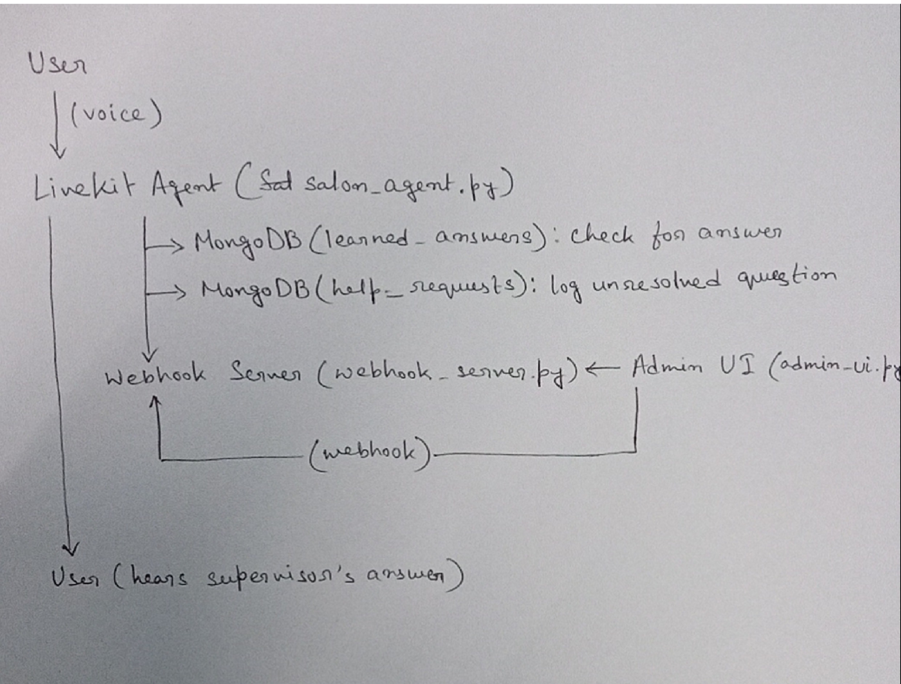

# Salon AI Assistant

An intelligent AI-powered virtual assistant for salon management, built with LiveKit.

## Overview

This project implements an AI assistant for salon management that can:
- Handle customer inquiries in real-time
- Process voice and text inputs
- Generate natural responses
- Escalate unknown queries to human supervisors
- Learn from supervisor responses for future interactions

## Features

- **Real-time Communication**: Built on LiveKit for real-time interactions
- **Multimodal Input**: Supports both voice and text input
- **Advanced Language Processing**: Uses Groq's Llama3 model for natural language understanding
- **Voice Capabilities**: 
  - Speech-to-Text using Deepgram's Nova-3
  - Text-to-Speech using Cartesia
  - Voice Activity Detection with Silero
- **Supervisor Integration**: Webhook system for supervisor intervention
- **Learning System**: Stores and learns from previous interactions
- **Admin Interface**: Web-based admin UI for monitoring and management.

## Prerequisites

- Python 3.8+
- MongoDB
- LiveKit account and credentials
- Groq API key
- Deepgram API key
- Cartesia API key

## Installation

1. Clone the repository:
```bash
git clone [repository-url]
cd [repository-name]
```

2. Create and activate a virtual environment:
```bash
python -m venv venv
source venv/bin/activate  # On Windows: venv\Scripts\activate
```

3. Install dependencies:
```bash
pip install -r requirements.txt
```

4. Create a `.env` file with your API keys:
```
LIVEKIT_API_KEY=your_livekit_key
LIVEKIT_API_SECRET=your_livekit_secret
GROQ_API_KEY=your_groq_key
DEEPGRAM_API_KEY=your_deepgram_key
CARTESIA_API_KEY=your_cartesia_key
```

## Project Structure

- `salon_agent.py`: Main AI agent implementation
- `webhook_server.py`: Webhook server for supervisor integration
- `help_requests_db.py`: Database operations for help requests and learned answers
- `admin_ui.py`: Admin interface implementation
- `templates/`: HTML templates for the admin interface
- `salon_prompt.txt`: System prompt for the AI agent

/frontdesk_
│
├── salon_agent.py         # Main LiveKit agent logic
├── help_requests_db.py    # MongoDB helpers for help requests & learned answers
├── webhook_server.py      # aiohttp server for supervisor answer delivery
├── admin_ui.py            # Flask admin UI for supervisors
├── templates/             # Jinja2 HTML templates for admin UI
│   ├── dashboard.html
│   ├── requests.html
│   ├── history.html
│   ├── learned_answers.html
│   └── base.html
├── salon_prompt.txt       # Agent prompt for LLM
├── .env                   # Environment variables (not committed)
└── requirements.txt       # (optional) for pip freeze

## Usage

1. Start the main agent:
```bash
python salon_agent.py console
```

2. Access the admin interface:
```bash
python admin_ui.py
```

## Supervisor Integration

The system includes a webhook endpoint at `/supervisor_answer` that accepts POST requests with:
- `session_id`: The current conversation session
- `answer`: The supervisor's response
- `request_id`: The ID of the help request

## API Design

### Webhook Endpoints

#### POST /supervisor_answer
Endpoint for supervisors to provide answers to customer queries.

**Request Body:**
```json
{
    "session_id": "string",    // Current conversation session ID
    "answer": "string",        // Supervisor's response
    "request_id": "string"     // ID of the help request
}
```

### Web Application Routes

#### Dashboard
- **GET /** - Main dashboard showing statistics and recent history

#### Request Management
- **GET /requests/<status>** - View requests by status
  - `status` can be: `pending`, `resolved`, or `unresolved`

#### History and Learning
- **GET /history** - View complete request history

- **GET /learned-answers** - View learned Q&A pairs
  - Displays all questions and answers stored in the knowledge base

#### Answer Submission
- **POST /answer/<request_id>** - Submit an answer for a request
  - Requires form data with `answer` field
  - Automatically:
    - Marks the request as resolved
    - Adds the Q&A to learned answers
    - Notifies the agent via webhook
  - Redirects back to pending requests view


## Logging
The system maintains detailed logs in:
- `salon_agent.log`: Main agent logs
- `webhook_server.log`: Webhook server logs
- `admin_ui.log`: Admin interface logs


## Database Design

- help_requests:
- Fields: _id, question, timestamp, status (pending, resolved, unresolved), conversation_id, notified, timeout_at, answer, resolved_at, unresolved_at, unresolved_reason

- learned_answers:
- Fields: _id, question, answer, added_at

## High-Level Architecture

Agent:
- The agent will use LiveKit's agent framework to handle real-time voice conversations.
- When a user asks a question, the agent should first check if we already know the answer (i.e., if it's in the prompt or in our knowledge base).
- If the LLM can't answer, the agent should say something like "Let me check with my supervisor and get back to you," and trigger a webhook logging the question for human follow-up.

Human-in-the-Loop:
- There is a web interface for a supervisor to see unresolved questions and provide answers.
- When a supervisor answers, the agent should immediately relay that answer to the user using the webhook server (if they're still present), and also store the Q&A for future use.

---



---